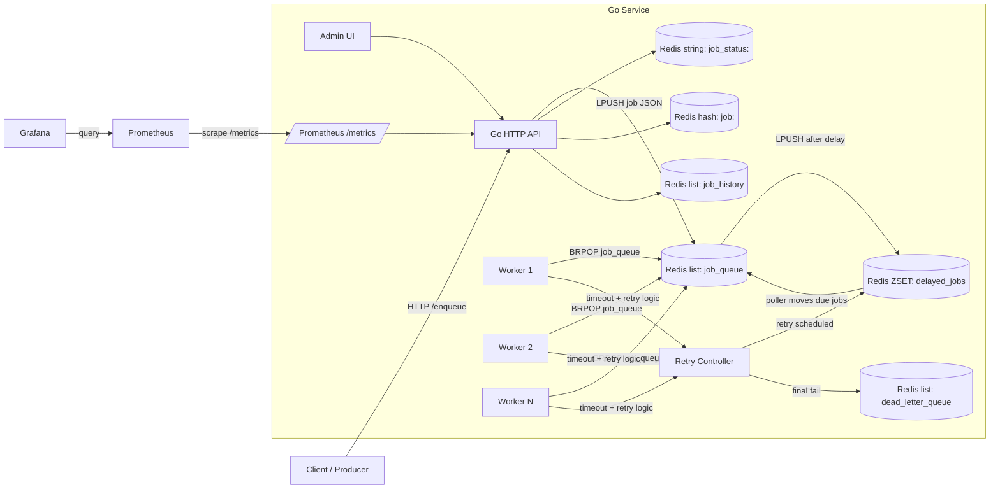

# Go Task Queue (Go + Redis)

Production-style background job queue written in Go. Jobs are stored in Redis, processed by a worker pool with timeouts, retried with exponential backoff, and tracked with Prometheus/Grafana. A small Admin UI provides visibility into recent jobs and DLQ management.

> **Purpose**
> Show how to build an end-to-end queueing system in Go: enqueue API → Redis persistence → worker execution → retries/DLQ → monitoring/operations.

---

## ✨ Features

* **Redis-backed queue** – jobs live in Redis lists, so multiple replicas can share the same queue
* **Delayed job support** – failed jobs go into a Redis sorted set and are re-enqueued after backoff
* **Worker pool with timeouts** – each worker runs jobs with a configurable timeout and graceful shutdown
* **Retries with exponential backoff** – retries grow as `5s * 2^attempt` until the job lands in the DLQ
* **Dead-letter queue + Admin UI** – monitor, retry, or delete permanently failing jobs in the browser
* **Prometheus metrics** – `/metrics` exports queue depth, DLQ size, throughput, and latency data points
* **Grafana dashboards** – optional Docker Compose stack with Prometheus + Grafana for visual monitoring

---

## 🏗 Architecture



**Queues & Keys**

* `job_queue` – main FIFO/LIFO list (LPUSH + BRPOP)
* `dead_letter_queue` – permanently failed jobs
* `job_status:<id>` – string status (`QUEUED/PROCESSING/RETRYING/SUCCESS/FAILED`)
* `job:<id>` – hash for job metadata (`started_at`, `ended_at`, retries)
* `job_history` – list of finished job IDs
* `delayed_jobs` – sorted set for retry scheduling (score is next execution timestamp)

---

## 📦 Project Layout

```
.
├── cmd/
│   └── main.go             # HTTP API, worker bootstrap, graceful shutdown
├── internal/
│   ├── http/
│   │   └── admin.go        # Admin UI template + handlers (list, retry, delete)
│   ├── metrics/
│   │   └── metrics.go      # Prometheus registry and custom collectors
│   └── queue/
│       ├── queue.go        # Job model, worker loop, retry/backoff logic
│       └── redis_queue.go  # Redis persistence, delayed queue poller, status utils
├── monitoring/
│   ├── grafana-data/       # Persisted Grafana state (mounted via Docker)
│   └── prometheus.yml      # Prometheus scrape config for the Go service
├── docker-compose.yml      # App + Redis + Prometheus + Grafana for local demo
├── Dockerfile              # Minimal container image for the Go service
├── go.mod / go.sum
└── README.md
```

---

## 🚀 Quick Start

### Option A – run everything with Docker Compose

```bash
docker compose up --build
```

What you get:

- Go service on `http://localhost:8080`
- Redis at `localhost:6379`
- Prometheus at `http://localhost:9090`
- Grafana at `http://localhost:3000` (credentials: `admin` / `admin`)

### Option B – run Go locally

1. Start Redis  
   ```bash
   # macOS
   brew install redis
   redis-server
   # Linux / Windows (WSL) quick option
   docker run --rm -p 6379:6379 redis:7-alpine
   ```
2. Run the service  
   ```bash
   go run ./cmd/main.go
   ```
3. Create some jobs  
   ```bash
   curl "http://localhost:8080/enqueue?name=VideoEncode"
   curl "http://localhost:8080/enqueue?name=EmailSend"
   ```
4. Inspect state  
   ```bash
   curl "http://localhost:8080/status?id=1"
   curl "http://localhost:8080/history"
   curl "http://localhost:8080/dlq"
   ```
5. Open the Admin UI – `http://localhost:8080/admin`

---

## 📈 Metrics & Monitoring

### Prometheus endpoint

* Available at: `http://localhost:8080/metrics`
* **Custom metrics**

  * `taskqueue_jobs_enqueued_total` (counter)
  * `taskqueue_jobs_completed_total` (counter)
  * `taskqueue_jobs_failed_total` (counter)
  * `taskqueue_job_processing_duration_seconds` (histogram)
  * `taskqueue_job_processing_duration_seconds_latest` (gauge)
  * `taskqueue_job_processing_duration_seconds_average` (gauge)
  * `taskqueue_queue_depth` (gauge)
  * `taskqueue_dlq_size` (gauge)

### Useful PromQL snippets

```promql
# p50 processing time (histogram)
histogram_quantile(0.5, sum(rate(taskqueue_job_processing_duration_seconds_bucket[2m])) by (le))

# enqueue vs completed (per‑minute rate)
rate(taskqueue_jobs_enqueued_total[1m])
rate(taskqueue_jobs_completed_total[1m])

# failures (per‑5m)
increase(taskqueue_jobs_failed_total[5m])
```

### Run Prometheus + Grafana via Docker Compose

* `docker compose up --build` already launches Prometheus and Grafana using `monitoring/prometheus.yml`.
* Prometheus scrapes `http://app:8080/metrics` inside the Compose network. If you run the Go service outside Docker, update the scrape target to `host.docker.internal:8080` (Mac/Win) or `172.17.0.1:8080` (Linux).
* Grafana persists state in `monitoring/grafana-data`. Import or build dashboards using the PromQL queries above (jobs throughput, queue depth, retry latency, DLQ size).

---

## ⚙️ Behavior & Design Notes

* **Worker execution & timeouts** – workers simulate variable processing time and enforce a 3s timeout. Timeouts count as failures and go through retry handling.
* **Retry / backoff** – retries increment `job.Retries` and enqueue the job into `delayed_jobs` with `5s * 2^retries` delay.
* **Delayed job poller** – a goroutine wakes every second, moves due jobs from `delayed_jobs` back to `job_queue`, and updates queue depth metrics.
* **Dead-letter queue** – after `MaxRetry` attempts (default 3), the job is shoved into `dead_letter_queue` and shows up in the Admin UI. Retry resets the counter; delete removes it permanently.
* **Status & history tracking** – lightweight Redis keys (`job_status:<id>`, `job:<id>`, `job_history`) make it easy to inspect job state from HTTP handlers or Redis CLI.
* **Graceful shutdown** – `main.go` listens for SIGINT/SIGTERM, drains the HTTP server, waits on the worker `WaitGroup`, and exits cleanly.

---

## 🔧 Configuration

* `REDIS_ADDR` – override Redis connection string (defaults to `localhost:6379`). Used by the service and the Docker Compose file.
* **Ports** – HTTP server listens on `:8080`, Prometheus uses `:9090`, Grafana uses `:3000`. Override via Docker Compose if needed.

---

## 🛠 API Surface

* `POST /enqueue?name=...` – create a job (defaults to `"Generic Job"` if name missing)
* `GET  /status?id=<id>` – text status response for a single job
* `GET  /history` – list of recent job IDs + statuses
* `GET  /dlq` – inspect raw DLQ contents from the terminal
* `GET  /admin` – Bootstrap-powered Admin UI (recent jobs + DLQ with retry/delete actions)
* `GET  /metrics` – Prometheus metrics endpoint

---

## 🧪 How To Demo (script)

1. Enqueue a bunch of jobs (some fail randomly):
   ```bash
   for i in {1..10}; do curl -s "http://localhost:8080/enqueue?name=Demo-$i"; done
   ```
2. Open `/admin` to watch jobs move from queued → processing → success/failure.
3. Explore the `/metrics` endpoint via Prometheus or curl; build Grafana panels for throughput, duration, queue depth.
4. Trigger retries from the Admin UI (`Retry` button) and confirm jobs re-enter processing.
5. Shut down with `Ctrl+C` and observe the graceful shutdown logs.

---

## 🧠 Scaling & Operations

* Scale the Go service horizontally; workers across replicas compete on the same Redis lists.
* Alert on sustained high `taskqueue_queue_depth` or `taskqueue_dlq_size`.
* Capture p95/p99 latency with Prometheus histograms if moving beyond the demo workload.
* Wrap the `/enqueue` handler with auth/rate-limiting before exposing externally.

---

## 📸 Screenshots (add to repo)

* `docs/grafana-dashboard.png` – key panels
* `docs/admin-ui.png` – Admin page

Embed them here once captured:

```md


```
---

## Deploy Link

https://go-distributed-task-queue.onrender.com/admin

---

## 🗺 Roadmap / Nice-to-haves

* Per-job-type handler registry (map job names → functions)
* Priority queues (multiple Redis lists with precedence)
* Scheduled jobs API (client-specified ETA rather than retries only)
* Persisted job payloads/results in a datastore
* Authentication/authorization on Admin UI routes
* Health checks and readiness probes for container deployments

---

## 🙌 Credits

Built by Devang to demonstrate Go concurrency, Redis-backed queues, and production-grade observability patterns.
