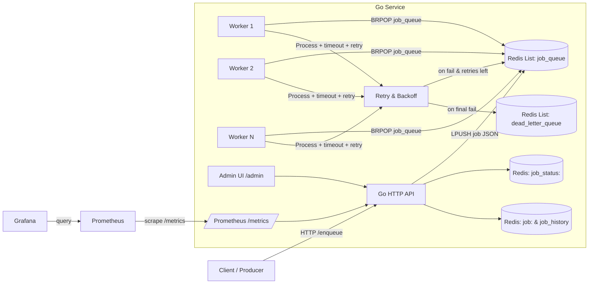

# Go Distributed Task Queue (Golang + Redis)

A production‑style task queue built in Go with Redis, worker pool, retries with exponential backoff, a Dead‑Letter Queue (DLQ), Prometheus metrics, Grafana dashboards, and a minimal Admin UI.

> **Why this project?**
> Demonstrates practical distributed‑systems skills: durability, concurrency, observability, fault‑tolerance, and operability.

---

## ✨ Features

* **Redis‑backed queue** (LPUSH/BRPOP) – works across processes/hosts
* **Worker pool** with per‑job timeout
* **Retries** with **exponential backoff**
* **Dead‑Letter Queue (DLQ)** for permanently failing jobs
* **Job status & history** in Redis (quick lookups + debugging)
* **Prometheus metrics** at `/metrics`
* **Grafana dashboard** (custom panels for queue health)
* **Admin UI** (read‑only list + DLQ actions: retry/delete)

---

## 🏗 Architecture



**Queues & Keys**

* `job_queue` – main FIFO/LIFO list (LPUSH + BRPOP)
* `dead_letter_queue` – permanently failed jobs
* `job_status:<id>` – string status (`QUEUED/PROCESSING/RETRYING/SUCCESS/FAILED`)
* `job:<id>` – hash for job metadata; `job_history` – list of finished job IDs

---

## 📦 Project Layout (suggested)

```
.
├── cmd/
│   └── main.go                # HTTP server, route wiring
├── internal/
│   ├── queue/
│   │   ├── queue.go           # job model, in‑mem queue, worker pool
│   │   └── redis_queue.go     # Redis client, enqueue/dequeue, DLQ
│   ├── metrics/
│   │   └── metrics.go         # Prometheus registry & metrics
│   └── http/
│       └── admin.go           # Admin UI routes & template
├── monitoring/
│   ├── docker-compose.yml     # Prometheus + Grafana stack
│   └── prometheus.yml         # Prometheus scrape config
└── README.md
```

---

## 🚀 Quick Start (local)

### 1) Start Redis

```bash
# Mac (brew)
brew install redis && redis-server
# Linux
docker run -p 6379:6379 redis:7-alpine
```

### 2) Run Go service

```bash
go run ./cmd/main.go
```

### 3) Enqueue a few jobs

```bash
curl "http://localhost:8080/enqueue?name=VideoEncode"
curl "http://localhost:8080/enqueue?name=EmailSend"
```

### 4) Check status / history

```bash
curl "http://localhost:8080/status?id=1"
curl "http://localhost:8080/history"
```

### 5) Admin UI

Open: `http://localhost:8080/admin`

---

## 📈 Metrics & Monitoring

### Prometheus endpoint

* Exposed at: `http://localhost:8080/metrics`
* **Custom metrics**

  * `taskqueue_jobs_enqueued_total` (counter)
  * `taskqueue_jobs_completed_total` (counter)
  * `taskqueue_jobs_failed_total` (counter)
  * `taskqueue_job_processing_duration_seconds` (histogram)
  * `taskqueue_job_processing_duration_seconds_latest` (gauge)
  * `taskqueue_job_processing_duration_seconds_average` (gauge)
  * `taskqueue_queue_depth` (gauge)
  * `taskqueue_dlq_size` (gauge)

### Useful PromQL snippets

```promql
# p50 processing time (histogram)
histogram_quantile(0.5, sum(rate(taskqueue_job_processing_duration_seconds_bucket[2m])) by (le))

# enqueue vs completed (per‑minute rate)
rate(taskqueue_jobs_enqueued_total[1m])
rate(taskqueue_jobs_completed_total[1m])

# failures (per‑5m)
increase(taskqueue_jobs_failed_total[5m])
```

### Run Prometheus + Grafana via Docker Compose

From `monitoring/`:

```bash
docker compose up -d
```

* Prometheus: [http://localhost:9090](http://localhost:9090)
* Grafana: [http://localhost:3000](http://localhost:3000) (admin / admin)
* In Grafana → **Connections → Data Sources** → add Prometheus with URL `http://prometheus:9090`.
* Create panels using the metrics above (e.g., *Jobs Enqueued*, *Jobs Completed*, *Queue Depth*, *Job Processing Time (Latest/Avg)*).

> If your Go service runs on host, use `host.docker.internal:8080` (Mac/Win) or `172.17.0.1:8080` (Linux) as Prometheus target in `prometheus.yml`.

---

## ⚙️ Behavior & Key Design Choices

### Worker execution and timeouts

* Each job runs with a timeout; long jobs are marked failed and retried or sent to DLQ.

### Retries with exponential backoff

* On failure: delay grows like `base * 2^retries` to avoid retry storms.

### Dead‑Letter Queue (DLQ)

* When retries exceed `MaxRetry`, job is pushed to `dead_letter_queue`.
* Admin UI exposes **Retry** (resets retries to 0) and **Delete** actions.

### Status & history

* Fast lookups via `job_status:<id>` strings.
* Metadata persisted in `job:<id>` hash; finished IDs appended to `job_history`.

---

## 🔧 Configuration (env vars you can add)

* `REDIS_ADDR` (default `localhost:6379`)
* `WORKER_COUNT` (default `3`)
* `JOB_TIMEOUT_SECONDS` (default `3`)
* `MAX_RETRY` (default `3`)
* `BACKOFF_BASE_SECONDS` (default `5`)

*(In code, read via `os.Getenv` with sensible fallbacks.)*

---

## 🛠 API Endpoints

* `POST /enqueue?name=...` → create a job
* `GET  /status?id=<id>` → job status
* `GET  /history` → recent finished jobs
* `GET  /admin` → admin dashboard (HTML)
* `POST /dlq/retry?id=<id>` → move job from DLQ to queue
* `POST /dlq/delete?id=<id>` → remove job from DLQ
* `GET  /metrics` → Prometheus metrics

---

## 🧪 How To Demo (script)

1. Enqueue 5–10 jobs (some will randomly fail):

   ```bash
   for i in {1..10}; do curl -s "http://localhost:8080/enqueue?name=Demo-$i"; done
   ```
2. Open `/admin` → see **Recent Jobs** and **DLQ** filling up.
3. In Grafana, watch panels:

   * *Jobs Enqueued/Completed*
   * *Queue Depth*
   * *Job Processing Time (Latest/Avg)*
4. Click **Retry** on some DLQ jobs → watch them re‑enter the queue.

---

## 🧠 Scaling & Operations

* **Horizontal scaling**: run more replicas of the Go service; all share Redis.
* **Autoscaling signal**: sustained `taskqueue_queue_depth` > threshold.
* **Graceful shutdown**: drain workers before stopping (add signal handling).
* **Observability**: alert on rising failures, growing DLQ, high p99 latency.

---

## 📸 Screenshots (add to repo)

* `docs/grafana-dashboard.png` – key panels
* `docs/admin-ui.png` – Admin page

Embed them here once captured:

```md


```

---

## 🗺 Roadmap / Nice‑to‑haves

* Per‑job‑type handlers (plugin registry)
* Priority queues (separate Redis lists)
* Scheduled jobs (delayed delivery bucket)
* Graceful shutdown & in‑flight job requeue
* Persistent job results storage
* Auth for Admin UI

---

## 🙌 Credits

Built by Devang to demonstrate Go concurrency, Redis, and production observability practices.
